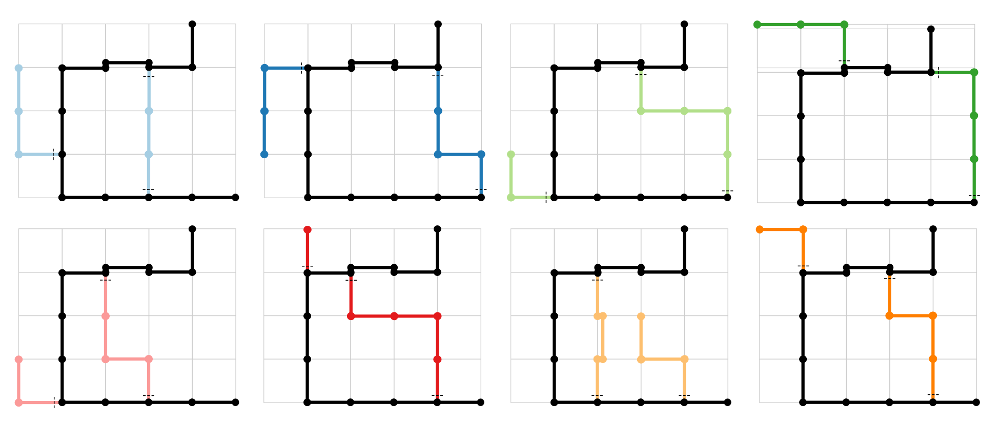

Getting started for this project
================================
* Download unique dependencies
```
conda install matplotlib seaborn jupyter pickle
```

Jupyter notebooks can be started by:

```
activate yourenv
*cd to directory where code is located*
jupyter notebook
```

Workflow
========

* Get sorted data from server. Put in a location that is convenient - this location will need to be modified in the following code to point to where the data is located on your machine.
* Make an "cache" folder in your directory that contains subfolders of "cscs", "events", "positions", "spikes".
* [MATLAB] run emi_loading_data.m -> This saves the data (cscs, poss, events, spikes) in a format that can be read in Python.
* [Python] run analysis scripts (see below for details).

## Specific analyses

This code contains analyses for:
* Behavior: shortcut_behavior.py
* Tuning curves: shortcut_tuning_curves.py
* Sharp-wave ripple detection: shortcut_swr.py
* Place field detection: shortcut_place_fields.py
* Co-occurrence: shortcut_cooccur.py
* Plot sequences: shortcut_plot_sequence.py


Shortcut task description
=========================

Below is a brief overview of shortcut experiment task and analysis work flow.


#### Objectives

The main objective of this task was to determine whether hippocampal place cells represent novel behaviorally-relevant trajectories that the subject has not yet physically encountered. Other objectives include investigating the neural patterns represented at corners versus straight edges, and along similarly oriented segments of a larger environment. This data may also be useful in establishing rodents' behavior when presented with novel options; here, novel trajectories are presented and traversed by the last running phase of the experiment.


#### Subjects

All experiments involving animals were conducted in accordance with the Canadian Council for Animal Care (CCAC) guidelines and were pre-approved by the University of Waterloo Animal Care Committee. Four male Long-Evans rats (Harlan; Mississauga, Canada), 5-10 months old, were acclimatized to human handling for 2-4 days before being food restricted. Rats were then food restricted such that they were approximately 90 % of their maximal weight. 

During this initial food restriction, they were exposed to a basic task with the maze pieces used in this experiment. In this 'U'-shaped task, we trained the rats until they were running about 100~laps in 40~min (rate of 2.5 laps/min), going between reward sites that dispensed two pellets (TestDiet, AIN-76A Rodent Tablet 45 mg; Richmond, IN) per trial. Specifically, when the photobeams from one reward site was triggered by the rat eating the reward, the other dispenser became 'available' and dispensed two pellets, while indicating its availability with blinking white LED lights. The rat needed to trigger the available reward site's photobeam for the first site to become active again.

Once the rats reliably ran at a rate of about 2.5 laps/min, they were fed ad lib until surgery. The rats were anesthetized with isoflurane and they were surgically implanted with a 16-array, 3-4-references microdrive targeting the right dorsal hippocampus. Following surgery, the tetrodes were individually lowered to the just above the cell layer, as determined by the local field potential (LFP) traces and audio output. The tetrode was then retracted and slowly lowered over the course of 6-35 days until in the hippocampal cell layer. Meanwhile, once the rats recovered from surgery they were again food restricted to about 90\% their maximal body weight.


#### Behavior

Behavioral recording sessions consisted of seven sequences (as outlined below, timing varied slightly between experiments), with the acquisition paused in between each session. Eight different shortcut/novel configurations were used for each subject, with a single configuration for each experimental day.

* **Pre-record**: approximately 5 min. On pedestal.
* **Phase 1**: approximately 8-10 min. "U"-shaped track.
* **Pause A**: approximately 10 min. On pedestal; set-up shortcut/novel.
* **Phase 2**: approximately 20 min. Barriers. Shortcut/novel segments set-up, but not yet available to the rat. Entrances to these segments are blocked by transparent barriers.
* **Pause B**: approximately 30 min. On pedestal; barriers removed at the beginning.
* **Phase 3**: approximately 50 min. Shortcut/novel tracks.
* **Post-record**: approximately 5 min. On pedestal.


#### Maze configurations



#### Recording

Signals were recorded from two headstages (Neuralynx Inc.; Montana, USA) plugged into the microdrive board connected to each tetrode and are recorded as local field potentials (LFPs) by the Neuralynx data acquisition software (Neuralynx Inc.; Montana, USA). Video tracking was accomplished with an overhead camera and red and green LEDs attached to the microdrive headstage. The Neuralynx software isolated spikes from the LFPs and that we use for spike sorting with MClust (MClust v3.5, written by A. David Redish) to isolate individual neurons.

#### Analysis

See detailed descriptions above.